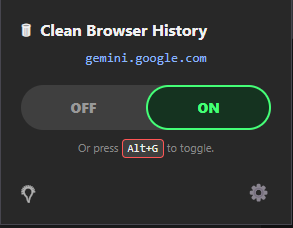
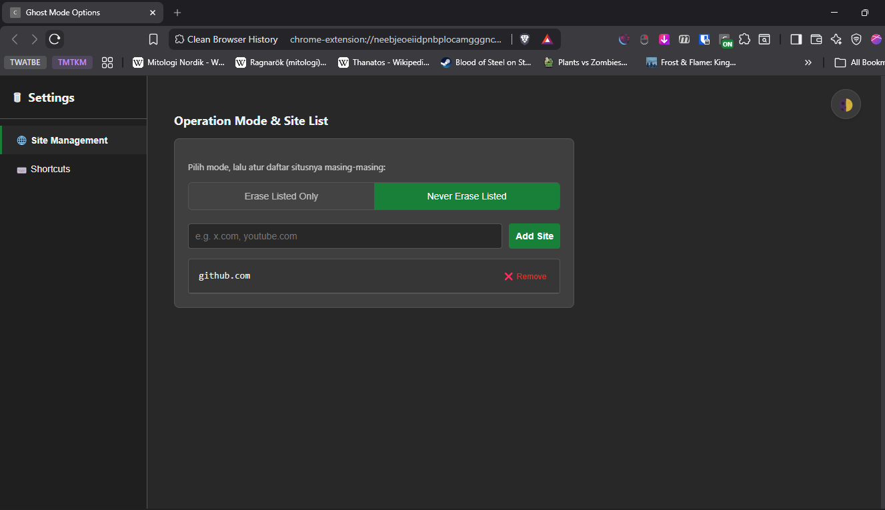

*Baca dalam bahasa lain: [🇬🇧 English](README.md)*
# 🗑️ Clean Browser History (Ghost Mode)
> [!NOTE]
> Current Version: 2.0.09032026

> "Ghost mode for your doomscrolling sessions. Keeps your history clean."

Sebuah ekstensi browser yang ringan, cepat, dan *robust* untuk menjaga histori browser tetap bersih saat sesi *doomscrolling*-mu. Keseluruhannya dibuat menggunakan HTML, CSS, dan Vanilla JavaScript (Manifest V3) tanpa *library* eksternal.

## ✨ Fitur Utama (Versi 2.0)
Ekstensi ini dibangun ulang secara keseluruhan dengan arsitektur baru yang terinspirasi dari manajemen daftar situs [ekstensi Dark Reader](https://chromewebstore.google.com/detail/dark-reader/eimadpbcbfnmbkopoojfekhnkhdbieeh).

* **Dual Operation Mode (Blacklist & Whitelist):**
  * **Erase Listed Only (Blacklist):** Hanya menghapus *history* dari situs yang didaftarkan secara eksplisit.
  * **Never Erase Listed (Whitelist):** Hapus seluruh *history* secara bawaan, KECUALI pada situs-situs yang didaftarkan.
* **Instant Toggle Popup:** Nyalakan atau matikan "Ghost Mode" untuk tab yang sedang aktif dengan satu klik.
* **Global Keyboard Shortcut:** Tekan `Alt+G` (default) untuk mengatur cleaning mode tanpa menggerakkan kursor tetikus atau membuka layar *popup*.
* **Real-time Theme Sync:** Dukungan penuh terhadap mode Terang dan Gelap. Pengaturan tema di *popup* akan menyinkronisasikan dan mengubah tema di halaman Opsi secara *real-time*!
* **Interactive Native Dashboard:** Sebuah halaman Opsi modern dan didukung *sidebar-style* untuk mengatur daftar situsmu dengan mudah.

## 📸 Screenshots

| Antarmuka Popup | Dashboard Opsi |
| :---: | :---: |
|  |  |

## 🚀 Installation (Developer Mode)
Karena ekstensi ini belum tersedia di Chrome Web Store, kamu dapat menginstal versi *bundled* secara manual:
### Penggunaan Baru
1. **Unduh Rilis Terbaru:** Pergi ke halaman [Releases](../../releases) *repository* ini dan unduh fail `.zip` terbaru (e.g., `CleanBrowserHistoryExtv2.0.zip`).
2. **Ekstrak:** Ekstrak fail ZIP yang telah diunduh ke sebuah folder baru di komputer.
3. Buka browser berbasis Chromium (Google Chrome, Brave, Edge, dll).
4. Pergi ke `chrome://extensions/` melalui *address bar*.
5. Nyalakan **Developer mode** dengan mengaktifkannya di tepi pojok kanan atas.
6. Klik tombol **Load unpacked** di kiri atas yang muncul.
7. Pilih folder tempat kamu mengekstrak file ekstensi.
8. Selesai! Sematkan ekstensi ke *browser toolbar* untuk memudahkan akses.
### Pembaruan
1. **Unduh Rilis Terbaru:** Pergi ke halaman [Releases](../../releases) *repository* ini dan unduh fail `.zip` terbaru (contoh: `CleanBrowserHistoryExtv2.0.zip`).
2. **Ekstrak:** Ekstrak fail ZIP yang telah diunduh ke folder tempat versi sebelumnya di komputermu.
3. **Pastikan aplikasi ZIP extractor (WinRar, 7zip, dsj) mengganti fail yang sudah ada (replace existing files)** untuk mencegah bentrok antar versi ketika ekstensi diakses di browser.
4. Buka browser berbasis Chromium (Google Chrome, Brave, Edge, dll).
5. Pergi ke `chrome://extensions/` melalui *address bar*.
6. Temukan ekstensi **Clean Browser History**. Muat ulang. Pastikan nomor versi berhasil diperbarui ke versi terbaru yang diunduh (contoh: `v2.0`).
7. Jika kamu sedang membuka halaman Opsi, Muat ulang untuk mengecek pembaruan.

## 📖 Panduan Singkat: Cara Kerja Tombol Toggle

Tombol *toggle* di dalam *popup* didesain agar sangat simpel dan intuitif. Kamu tidak perlu pusing memikirkan daftar di baliknya; cukup perhatikan status tombol saat membuka sebuah situs:

* **🟢 Toggle ON (Menyala):** Ghost Mode **AKTIF**. Histori penelusuran untuk situs ini **akan langsung dihapus** sesaat setelah kamu mengunjunginya.
* **🔴 Toggle OFF (Mati):** Ghost Mode **NONAKTIF**. Histori penelusuran untuk situs ini **akan disimpan** secara normal oleh *browser*.

> **💡 Tips Pro:** Di balik layar, menekan tombol ini akan mengelola daftar situsmu secara otomatis. Saat kamu menyalakannya (ON), ekstensi akan otomatis memasukkan/mengeluarkan situs tersebut dari *Blacklist* atau *Whitelist* di halaman Opsi agar historinya dipastikan terhapus!

## ⚙️ Mengapa butuh akses berikut?
Ekstensi ini dibangun dengan upaya tetap mengutamakan privasi pengguna. Permohonan akses yang dideklarasikan di `manifest.json` digunakan secara ketat agar fungsi utama ekstensi dapat berjalan secara optimal.
* `"history"`: Digunakan **hanya** untuk menghapus URL spesifik secara spontan setelah kamu mengaksesnya. Ekstensi ini TIDAK MEMBACA, MENGUMPULKAN, ATAU MENGIRIMKAN data historimu ke server manapun.
* `"storage"`: Digunakan untuk menyimpan preferensi daftar situs (Blacklist/Whitelist) dan kondisi tema (Gelap/Terang) secara lokal di browsermu.
* `"tabs"`: Digunakan untuk membaca URL yang sedang diakses di tab aktif untuk menentukan apakah situs yang diakses saat ini perlu dipantau (dibersihkan historinya) atau tidak, serta mendeteksi penggunaan *hotkey* `Alt+G`.

## 👨‍💻 Author
Dikembangkan oleh **Zeyn The Dev**.

## 📄 Lisensi
Didistribusikan menggunakan **MIT License**. Cek `LICENSE` untuk informasi lebih lanjut.