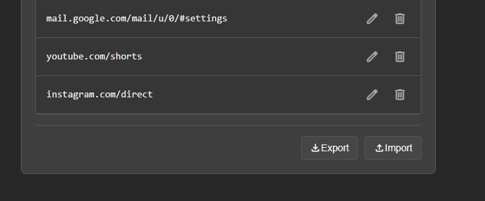

*Read this in other languages: [🇮🇩 Bahasa Indonesia](README.id.md)*
# 🗑️ Clean Browser History (Ghost Mode)
> [!NOTE]
> Current Version: 2.1.20032026

> "Ghost mode for your doomscrolling sessions. Keeps your history clean."

A lightweight, fast, and robust browser extension to keep your browsing history clean during your doomscrolling sessions. Built entirely using HTML, CSS, and Vanilla JavaScript (Manifest V3) without any external libraries.

📖 **[Read the Full User Manual on our Wiki!](https://github.com/ZeynTheDev/CleanBrowserHistoryExt/wiki)**

## 🌟 What's New in Version 2.1
The extension just got a massive upgrade for Power Users!
* **Path-Specific Rules (Custom URL):** You can now target specific parts of a website! For example, adding `mangadex.org/chapter` or `youtube.com/watch` will instantly wipe your reading/watching history while keeping your main homepage visits perfectly intact.
* **Backup & Restore:** Spent time crafting the perfect Blacklist/Whitelist? You can now Export and Import your lists as a secure JSON file.
* **Bilingual Support:** The Options Dashboard now fully supports seamless switching between English (EN) and Indonesian (ID) via a dropdown menu.
* **Modernized UI & Inline Editing:** The dashboard has been polished with Google Material Symbols and now supports editing your URLs directly from the list without needing to delete and re-add them.

## ✨ Core Features
* **Dual Operation Mode:**
  * **Erase Listed Only (Blacklist):** Only deletes the history of explicitly listed sites/paths.
  * **Never Erase Listed (Whitelist):** Deletes ALL history by default, EXCEPT for the sites in your safe list.
* **Instant Toggle Popup:** Turn "Ghost Mode" on or off for the currently active tab with just a single click.
* **Global Keyboard Shortcut:** Press `Alt+G` (default) to toggle the cleaning mode without moving your mouse.
* **Real-time Theme Sync:** Full support for Dark and Light modes across the popup and options page.

## 📸 Screenshots

| Popup Interface | Options Dashboard | Export/Import (NEW FEATURE!) |
| :---: | :---: | :---: |
|  |  |  |

## 🚀 Installation (Developer Mode)

Since this extension is currently in active development, you can install the bundled version manually:

### For New Usage
1. **Download the Release:** Go to the [Releases](../../releases) page of this repository and download the latest `.zip` file (e.g., `CleanBrowserHistoryExtv2.1.zip`).
2. **Extract:** Extract the downloaded ZIP file into a permanent folder on your computer.
3. Open a Chromium-based browser (Google Chrome, Brave, Edge, etc.).
4. Navigate to `chrome://extensions/` in your address bar.
5. Enable the **Developer mode** toggle in the top right corner.
6. Click the **Load unpacked** button in the top left.
7. Select the folder where you extracted the extension files.
8. Done! Pin the 🗑️ icon to your browser's toolbar for easy access.

### For Update
1. **Download the Release:** Download the latest `.zip` file from the [Releases](../../releases) page.
2. **Extract & Overwrite:** Extract the ZIP file into your existing extension folder. **Ensure your extractor replaces the existing files** to prevent multi-version crashes.
3. Navigate to `chrome://extensions/` in your browser.
4. Find the **Clean Browser History** extension and click the **Reload** (🔄) icon.
5. Ensure the version is updated to the latest (e.g., `v2.1`).

## ⚙️ Why these Permissions?

This extension is built with absolute privacy in mind. The permissions declared in `manifest.json` are strictly used for core functionalities:
* `"history"`: Used **only** to delete specific URLs immediately after you visit them. This extension DOES NOT read, collect, or send your history data to any remote server.
* `"storage"`: Used to save your list preferences, language, and theme state locally in your browser.
* `"tabs"`: Used to read the URL of the active tab to determine whether the current site should be monitored, and to detect the `Alt+G` hotkey press.

## 👨‍💻 Author
Developed by **Zeyn The Dev**.

## 📄 License
Distributed under the **MIT License**. See `LICENSE` for more information.